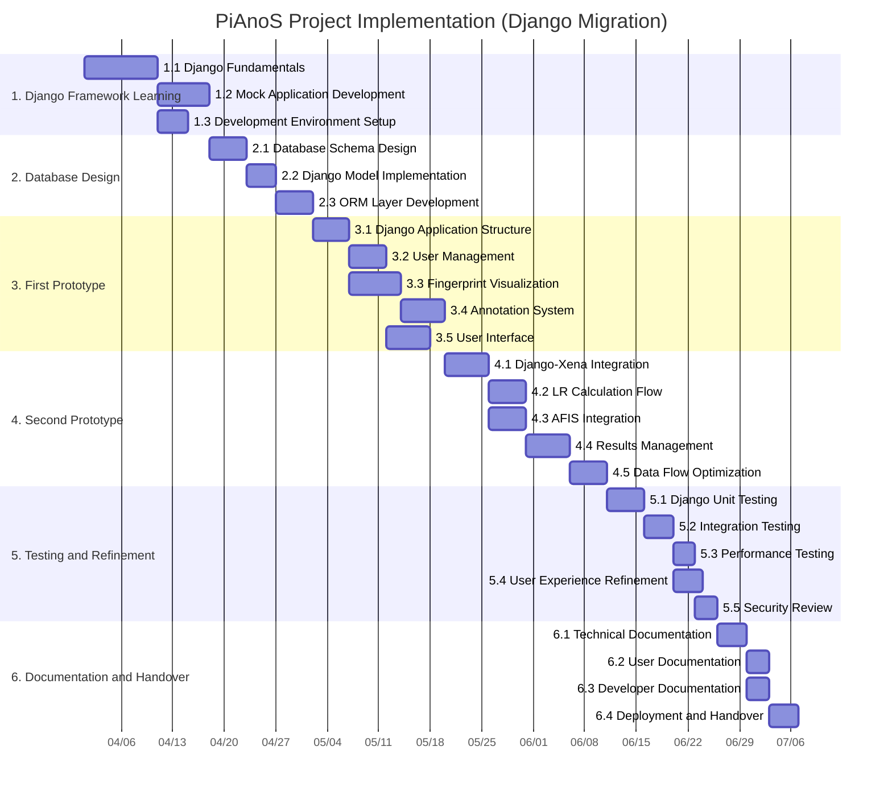

```mermaid
gantt
    title PiAnoS Project Implementation (Django Migration)
    dateFormat  YYYY-MM-DD
    axisFormat %m/%d
    todayMarker off
    
    section 1. Django Framework Learning
    1.1 Django Fundamentals           :a1, 2025-04-01, 10d
    1.2 Mock Application Development  :a2, after a1, 7d
    1.3 Development Environment Setup :a3, after a1, 4d
    
    section 2. Database Design
    2.1 Database Schema Design        :b1, after a2, 5d
    2.2 Django Model Implementation   :b2, after b1, 4d
    2.3 ORM Layer Development         :b3, after b2, 5d
    
    section 3. First Prototype
    3.1 Django Application Structure  :c1, after b3, 5d
    3.2 User Management               :c2, after c1, 5d
    3.3 Fingerprint Visualization     :c3, after c1, 7d
    3.4 Annotation System             :c4, after c3, 6d
    3.5 User Interface                :c5, after c2, 6d
    
    section 4. Second Prototype
    4.1 Django-Xena Integration       :d1, after c4 c5, 6d
    4.2 LR Calculation Flow           :d2, after d1, 5d
    4.3 AFIS Integration              :d3, after d1, 5d
    4.4 Results Management            :d4, after d2 d3, 6d
    4.5 Data Flow Optimization        :d5, after d4, 5d
    
    section 5. Testing and Refinement
    5.1 Django Unit Testing           :e1, after d5, 5d
    5.2 Integration Testing           :e2, after e1, 4d
    5.3 Performance Testing           :e3, after e2, 3d
    5.4 User Experience Refinement    :e4, after e2, 4d
    5.5 Security Review               :e5, after e3, 3d
    
    section 6. Documentation and Handover
    6.1 Technical Documentation       :f1, after e4 e5, 4d
    6.2 User Documentation            :f2, after f1, 3d
    6.3 Developer Documentation       :f3, after f1, 3d
    6.4 Deployment and Handover       :f4, after f2 f3, 4d
```